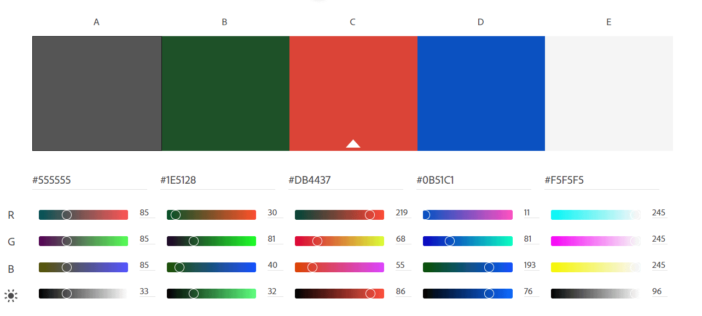
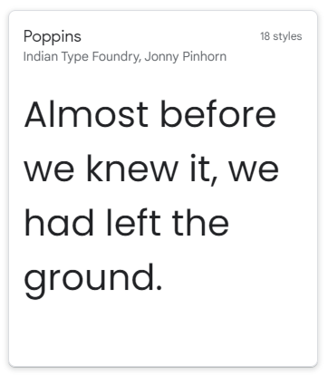
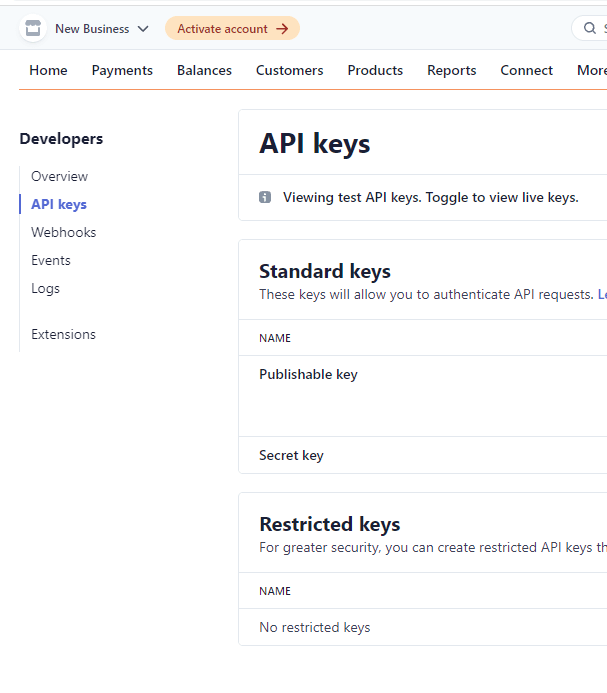
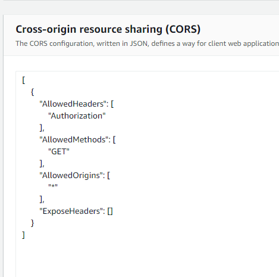
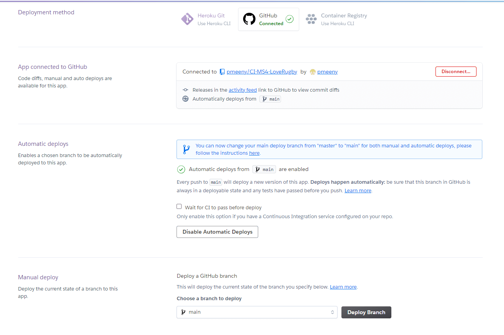

# Love Rugby shop
Love Rugby is a website that allows users 

- There are two types of users, and I have set up accounts for both
    - An admin user account has been set up with username/password of administrator/Password123
    - A regular user account has been set up with username/password of mikemurphy/Password123
<br>

**View the live site [here](https://ci-ms4-loverugby.herokuapp.com/)**
<br><br>


# Table of Contents

# Project Overview
- This project is a website is for submission as milestone project 4 as part of the Code Institute - Diploma in Software Development (Full stack) course.
- The website is deployed using Heroku pages at the following url: [Love Rugby](https://ci-ms4-loverugby.herokuapp.com/)
- The repository on GitHub that contains the website source code and assets is available at the following url: [Code Repository](https://github.com/pmeeny/CI-MS4-LoveRugby)
- The website was built with a responsive look and feel for desktop, tablet and mobile devices

# UX
## Strategy
### Primary Goal
The primary goal of the website from the site 
owners perspective is as follows:
- To add, edit and delete products with the relevant information (price, description, rating, comments, image, sizes and category) on the website 
- To allow a user make a purchase of the products on the website
- To categorise sale items on the website
- To add, edit and delete website news for publication to website users

The primary goal of the website from a site users perspective is as follows:
- To register for an account on the website and receive an email after succesful registration
- To login or logout from the website
- To easily recover my password in case I forget it
- Have a personalised user profile with my delivery, payment information and order history
- View a list of products on the website
- View an individual product detail(price, description, rating, comments, image, sizes and category)
- To add an item to a shopping bag, and select the quantity and size if applicable
- Complete a purchase of items in a shopping bag
- To post a review(rating and comment) on a product
- To sort the list of available products by rating, price and category
- Search for a product by name or descrption and view the search results
- To view website news

## Structure
### Website pages
I have structured the website into 19 pages, each with clear, concise structure, information and purpose. I use the Bootstrap grid system throughout, which gave a consistent structure and responsive design "out of the box"

### Code Structure.
The project is divided into a number of apps, as is built using the Django Framework
The apps are described as follows
bag (part of the original Boutique Ado project)
bag (part of the original Boutique Ado project)
favourites (A new app that allows a user to view, add and remove favourites) 
bag (part of the original Boutique Ado project, I built onto this app to add a review(rating and comment))
   
### Database
- The website is a data-centric one with html, javascript, css used with the bootstrap(version 5) framework as a frontend
- The backend consists of Python built with the Django framework with a database of a postgres


#### Conceptual database model
The first step in the database design was to create a conceptual data model. The helped me understand the design at a conceptual level while enabling me to understand the required collections in the database


#### Physical database model
From the conceptual database model I created the physical database model. This model contains all fields stored in the database collections with their data type and mimics the structure of what is actually stored in the mongo database(mongodb)
<br>
Note: The lines/links in the diagram denote the relationship in the python code between the different collection fields and not foreign keys, for example 
when a memory is created in the memories' collection, it also stores the tournament name from the tournament's collection.


#### Postgres DB database information
- One production database(Postgres) was created to store site information, it contains five collections described below


#### Model
- The model

### Amazon Web Services S3 bucket
While postgres stores the majority of the users' data in the database, any images added
by an admin user for a product is stored in an Amazon Web services(AWS) S3(storage) bucket. 
I made this choice for performance reasons(https://aws.amazon.com/s3/faqs/)
and to challenge myself to learn how to integrate the site with AWS.
Here are the steps I took for the integration
1. I created an account with AWS, and created an S3 bucket named "ci-ms3-football-memories"

2. I created a user in AWS IAM, and gave the user the AmazonS3FullAccess permission   
3. I then gave the bucket policy the necessary permissions to allow my application to access 
the S3 bucket

4. I imported the Boto3 python library (https://boto3.amazonaws.com/) in the util.py file
I made a design decision to have an util.py in an util flask route python file that would be used to store common code
that could be used by multiple routes
5. The relevant s3 variables for the bucket name, url and access/secret keys are defined at the top of the util.py file
   <code>
   s3_bucket_name = "ci-ms3-football-memories"
s3_bucket_url = "https://ci-ms3-football-memories.s3.eu-west-1.amazonaws.com/"
client = boto3.client('s3', 
                aws_access_key_id=os.environ.get("AWS_ACCESS_KEY_ID"),
                aws_secret_access_key=os.environ.get("AWS_SECRET_ACCESS_KEY"))
   </code>
6. A single function was written named storeImageAWSS3Bucket that takes one parameter, the filename to store
7. This single function is used by the tournament and memories routes to store the images in the S3 bucket
8. This function stores a file in an AWS S3 bucket using boto3. The filename is in the form timestamp + name of file added by the user. The timestamp ensures uniqueness for every file added to the s3 bucket allowing users to use the same filename if desired.<code>
   image_file = secure_filename(image.filename)
    image_to_upload = timestamp + image_file</code>
9. The boto3 put_object method is used to store the image taking two parameters, the file name and actual file
<code>s3.Bucket(s3_bucket_name).put_object(Key=image_to_upload, Body=image)</code>
10. An image url is returned, and it is the image url that is stored in the mongodb for the relevant tournament or memory, described below in the two screenshots, field 
names memory_image and tournament_image in the memory and tournament collections
<code>image_url = s3_bucket_url + image_to_upload</code>


   

## Scope
There is overlap in terms of user stories for the two types of users, and they are described below
### User Stories Potential or Existing Customer
The user stories for the website user "shopper user" (a potential or existing customer) are described as follows: 
- User Story 1.1: As a shopper user the navigation bar is displayed with a logo on all pages for easy navigation, with a burger menu on mobile devices


### User Stories Website Owner
The user stories for the website owner(admin user) are described as follows: 
There is a lot of overlap between the two user types, the admin user however has more administrative rights throughout
- User Story 1.1: As an admin user the navigation bar is displayed with a logo on all pages for easy navigation, with a burger menu on mobile devices

## Skeleton
### Wireframes
Each wireframe image below contains three sub images, one for desktop, tablet and mobile

Page | Wireframe | 
------------ | ------------- 
bag/templates/bag/bag.html | [Desktop/Tablet/Mobile](readme/wireframes/bag.png)
checkout/templates/checkout/checkout.html | [Desktop/Tablet/Mobile](readme/wireframes/checkout.png)
checkout/templates/checkout/checkout_success.html | [Desktop/Tablet/Mobile](readme/wireframes/checkout_success.png)
favourites/templates/favourites/favourites.html | [Desktop/Tablet/Mobile](readme/wireframes/favourites.png)
home/templates/home/index.html | [Desktop/Tablet/Mobile](readme/wireframes/index.png)
news/templates/news/add_news_item.html | [Desktop/Tablet/Mobile](readme/wireframes/add_news_item.png)
news/templates/news/edit_news_item.html | [Desktop/Tablet/Mobile](readme/wireframes/edit_news_item.png)
news/templates/news/manage_news_items.html  | [Desktop/Tablet/Mobile](readme/wireframes/manage_news_items.png)
news/templates/news/news.html | [Desktop/Tablet/Mobile](readme/wireframes/news.png)
news/templates/news/news_item.html | [Desktop/Tablet/Mobile](readme/wireframes/news_item.png)
products/templates/products/add_product.html | [Desktop/Tablet/Mobile](readme/wireframes/add_product.png)
products/templates/products/edit_product.html | [Desktop/Tablet/Mobile](readme/wireframes/edit_product.png)
products/templates/products/product_detail.html | [Desktop/Tablet/Mobile](readme/wireframes/product_detail.png)
products/templates/products/products.html  | [Desktop/Tablet/Mobile](readme/wireframes/products.png)
products/templates/products/sale_items.html | [Desktop/Tablet/Mobile](readme/wireframes/sale_items.png)
profile/templates/profile/profile.html | [Desktop/Tablet/Mobile](readme/wireframes/profile.png)
profile/templates/profile/order_history.html | [Desktop/Tablet/Mobile](readme/wireframes/order_history.png)
templates/allauth/account/login.html | [Desktop/Tablet/Mobile](readme/wireframes/login.png)
templates/allauth/account/logout.html | [Desktop/Tablet/Mobile](readme/wireframes/logout.png)
templates/allauth/account/register.html| [Desktop/Tablet/Mobile](readme/wireframes/register.png)

## Surface
### Color Palette
I have gone for a simple and minimal design for the website, with predominately green, grey and whitesmoke font colours
There are five colours in the color palette
- 000000/555555 - Black and grey colours for the majority ot text on the website
- 1E5128 - Dark green for background and buttons
- DB4437 - Warning and sale item buttons and text
- 0B51C1 - Blue for links
- F5F5F5/FFFFFF - Whitesmoke and white for background colours

I feel the colours complement each other very well, and I choose those colours after testing a number of palettes while making sure the colour palette met accessibility standards.


### Typography
The Poppins font is the main font used throughout the whole website with Sans Serif as the fallback font in case for any reason the Poppins font cannot be imported into the website correctly. This font is from the Google fonts library.


# Features
The website has seven distinct features, and they are described below
## Existing Features
### Feature 1 Navigation Bar
#### Description feature 1

#### User Stories feature 1
- User Story 1.1: As an admin/regular user the navigation bar is displayed with a logo on all pages for easy navigation, with a burger menu on mobile devices

##  Features Left to Implement
- I am content with what was implemented. The site is a feature rich site
- However, here are some additional "nice to have" features and updates that could be added to the project

Number | Update  
 ------------ | ------- |
1 | A communication app between shoppers and the store owner |
2 | Increased code coverage and unit tests in the checkout view.py for stripe payments |
3 | A new release section displaying new release products |
4 | Improved searching and filtering on the products page, a side panel filter |

# Technologies Used
## Languages 
- HTML (https://en.wikipedia.org/wiki/HTML)
    - The project uses html to build the relevant pages
- CSS (https://en.wikipedia.org/wiki/CSS)
    - The project uses CSS to style the relevant pages
- Javascript (https://www.javascript.com/)
    - Javascript was used for all scripting on the site 
- Django (https://www.djangoproject.com/)
    - Django is the framework used in this project
    - The Django templating language was used to render pages
    - The Django unit test librarywas used for unit tests (https://docs.djangoproject.com/en/3.2/topics/testing/overview/)
- Python v3.9 (https://www.python.org/)
    - Python was used for server side coding on the project, a number of libraries were also used(The requirements.txt file 
  contains this list):
      - asgiref==3.4.1 (Support for Python asynchronous web apps and servers to communicate with each other) 
      - boto3==1.18.47 (Python SDK for AWS)
      - botocore==1.21.47 (Python SDK for AWS) 
      - dj-database-url==0.5.0 (Support for DATABASE_URL enviroment variable)
      - Django==3.2.7 (Web framework)
      - django-allauth==0.41.0 (Web framework authetication)
      - django-countries==7.2.1 (ISO 3166 countries list)
      - django-crispy-forms==1.12.0 (Django rendering of forms)
      - django-storages==1.11.1 (Django storage backend for AWS S3)
      - gunicorn==20.1.0 (Python WSGI Http server)
      - jmespath==0.10.0 (Full suite of data driven testcase)
      - oauthlib==3.1.1 (Framework for oauth1 and oauth2)
      - Pillow==8.3.2 (Imaging library)
      - psycopg2-binary==2.9.1 (Postgres adapter)
      - python3-openid==3.2.0 (Support for the OpenID decentralized identity system)
      - pytz==2021.1 (Interface to the IANA database, which uses ASCII name)
      - requests-oauthlib==1.3.0 (Authentication support for Requests)
      - s3transfer==0.5.0 (Python library for managing Amazon S3 transfers)
      - sqlparse==0.4.1 (Non-validating SQL parser for Python)
      - stripe==2.60.0 (SDK for processing payments)

    
## Libraries and other resources
- Bootstrap 5.0 (https://getbootstrap.com/docs/5.0)
    - The project uses the bootstrap library for some UI components in the website (Buttons, Card, Carousel, Modal, Pagination, Navbar)
- Gitpod (https://gitpod.io/)
    - Gitpod was used as an IDE for the project initially, then I switched to Pycharm
- Pycharm (https://www.jetbrains.com/pycharm/)
    - Pycharm was the main IDE used on the project
- Github (https://github.com/)
    - GitHub was used to store the project code in a repository
- Google Fonts (https://fonts.google.com/)
    - Google font Poppins was used as the website font
- Balsamiq (https://balsamiq.com/)
    - Balsamiq was used to create the website wireframes
- Font Awesome (https://fontawesome.com/)
    - Font awesome was used to provide the relevant fonts/icons for the website
- Lucidchart (http://lucidchart.com)    
    - Lucidchart was used to create the database design diagrams
- JQuery (https://jquery.com)
    - JQuery was used in some javascript files for DOM manipulation
- TinyPNG (https://tinypng.com/)
    - TinyPNG was used to compress images to improve performance and reduce space
- CSS Validation Service (https://jigsaw.w3.org/css-validator/)
   - CSS validation service for validation the css in the project  
- HTML Markup Validation Service (https://validator.w3.org/)   
    - HTML validation service for validation the css in the project  
- Chrome dev tools (https://developers.google.com/web/tools/chrome-devtools)
    - For troubleshooting and debugging of the project code
- Chrome Lighthouse (https://developers.google.com/web/tools/lighthouse)
    - For performance, accessibility, progressive web apps, SEO analysis of the project code
- Responsive Design (http://ami.responsivedesign.is/)
    - Website for generating the responsive image in this README
- JS Fiddle (https://jsfiddle.net/)
    - Used for testing html and css concepts
- GitHub Wiki TOC generator (https://ecotrust-canada.github.io/markdown-toc/)
    - Used for generating a table of contents for this README
- Gofullpage chrome plugin  (https://chrome.google.com/webstore/detail/gofullpage-full-page-scre)
    - This plugin was used to take full page screenshots for testing images
- Python online interpreter (https://www.programiz.com/python-programming/online-compiler/)
    - For testing python code snippets
- Unittest (https://docs.djangoproject.com/en/3.2/topics/testing/overview/)
    - For Python unit testing
- UILicious (www.uilicious.com)
    - For automated testing
- JSHint (https://jshint.com/)
  - For javascript code quality
- PEP8 (https://www.python.org/dev/peps/pep-0008/)
  - I used the pep8 code analysis plugin in Pycharm to check for pep8 errors
- Stripe
  - For processing a test credit card to test a payment as part of an order
- Coverage
  - For unit test code coverage reports

# Testing
The testing information and results for this project are documented in [TESTING.md](TESTING.md)

# APIs and configuration
The project also uses a number of API's and configuration, below are the steps to configure the API in your environment

## Email JS
1. Create an account at emailjs.com 
2. In the integration screen in the emailjs dashboard, note your userid, this is a unique string for your users
3. Create an email service in the Email Services section and note the id, for example "gmail"
4. Create an email template in the Email templates section and note the id, for example "love_rugby"
5. Update the script /static/js/sendEmail.js, the method sendMail with your user id, email service id and email template id

## Google emails
To set up the project to send emails and to use a Google account as an SMTP server, the following steps are required
1. Create an email account at google.com, login, navigate to Settings in your gmail account and then click on Other Google Account Settings
2. Turn on 2-step verification and follow the steps to enable
3. Click on app passwords, select Other as the app and give the password a name, for example Django


4. Click create and a 16 digit password will be generated, note the password down
5. In the env.py file, create an environment variable called EMAIL_HOST_PASS with the 16 digit password
6. In the env.py file, create an environment variable called EMAIL_HOST_USER with the email address of the gmail account
7. Set and confirm the following values in the settings.py file to successfully send emails
<br><code>EMAIL_BACKEND = 'django.core.mail.backends.smtp.EmailBackend'</code>
<br><code>EMAIL_USE_TLS = True</code>
<br><code>EMAIL_PORT = 587</code>
<br><code>EMAIL_HOST = 'smtp.gmail.com'</code>
<br><code>EMAIL_HOST_USER = os.environ.get('EMAIL_HOST_USER')</code>
<br><code>EMAIL_HOST_PASSWORD = os.environ.get('EMAIL_HOST_PASS')</code>
<br><code>DEFAULT_FROM_EMAIL = os.environ.get('EMAIL_HOST_USER')</code>
8. You will also need to set the variables EMAIL_HOST_PASS and EMAIL_HOST_USER in your production instance, for example Heroku

## Stripe
1. Register for an account at stripe.com
2. Click on the Developers section of your account once logged in
3. Under Developers, click on the API keys section



4. Note the values for the publishable and secret keys
5. In your local enviroment(env.py) and heroku, create enviroment variables STRIPE_PUBLIC_KEY and STRIPE_SECRET_KEY with the publishable and secret key values
<br><code>os.environ.setdefault('STRIPE_PUBLIC_KEY', 'YOUR_VALUE_GOES_HERE')</code>
<br><code>os.environ.setdefault('STRIPE_SECRET_KEY', 'YOUR_VALUE_GOES_HERE')</code>
6. Back in the Developers section of your stripe account click on Webhooks
7. Create a webhook with the url of your website <url>/checkout/wh/, for example: https://ci-ms4-loverugby.herokuapp.com/checkout/wh/
8. Select the payment_intent.payment_failed and payment_intent.succeeded as events to send

9. Note the key created for this webhook
10. In your local enviroment(env.py) and heroku, create enviroment variable STRIPE_WH_SECRET with the secret values
<code>os.environ.setdefault('STRIPE_WH_SECRET', 'YOUR_VALUE_GOES_HERE')</code>
11. Feel free to test out the webhook and note the succcess/fail attempts for troubleshooting

# Deployment
There are a number of applications that need to be configured to run this application locally or on a cloud based service, for example Heroku

## Amazon WebServices
1. Create an account at aws.amazon.com
2. Open the S3 application and create an S3 bucket named "ci-ms4-rugby-shop"
3. Uncheck the "Block All Public access setting"
4. In the Properties section, navigate to the "Static Website Hosting" section and click edit
5. Enable the setting, and set the index.html and the error.html values
<br>
6. In the Permissions section, click edit on the CORS configuration and set the below configuration
<br>
7. In the permissions section, click edit on the bucket policy and generate and set the below configuration(or similar to your settings)
<br>
8. In the permissions section, click edit on the Access control list(ACL)
9. Set Read access for the Bucket ACL for Everyone(Public Access)

## Postgres Database
Postgres is the database used in the application for production. The database is created as part of setting up
a deployment on Heroku, which is described below

## Local Deployment
To run this project locally, you will need to clone the repository
1. Login to GitHub (https://wwww.github.com)
2. Select the repository pmeeny/CI-MS4-LoveRugby
3. Click the Code button and copy the HTTPS url, for example: https://github.com/pmeeny/CI-MS4-LoveRugby.git
4. In your IDE, open a terminal and run the git clone command, for example 

    ```git clone https://github.com/pmeeny/CI-MS4-LoveRugby.git```

5. The repository will now be cloned in your workspace
6. Create an env.py file(do not commit this file to source control) in the root folder in your project, and add in the following code with the relevant key, value pairs, and ensure you enter the correct key values<br>
<br><code>import os</code>
<br><code>os.environ.setdefault("SECRET_KEY", TO BE ADDED BY USER)</code>
<br><code>os.environ.setdefault("STRIPE_PUBLIC_KEY", TO BE ADDED BY USER)</code>
<br><code>os.environ.setdefault("STRIPE_SECRET_KEY", TO BE ADDED BY USER)</code>
<br><code>os.environ.setdefault("STRIPE_WH_SECRET", TO BE ADDED BY USER)</code>
<br><code>os.environ.setdefault("AWS_ACCESS_KEY_ID", TO BE ADDED BY USER)</code>
<br><code>os.environ.setdefault("AWS_SECRET_ACCESS_KEY", TO BE ADDED BY USER)</code>
<br><code>os.environ.setdefault("EMAIL_HOST_USER", TO BE ADDED BY USER)</code>
<br><code>os.environ.setdefault("EMAIL_HOST_PASS", TO BE ADDED BY USER)</code>
<br><code>os.environ.setdefault("USE_AWS", TO BE ADDED BY USER)</code>
<br><code>os.environ.setdefault("DATABASE_URL", TO BE ADDED BY USER)</code>
7. Some values for the environment variables above are described in different sections of this readme
8. Install the relevant packages as per the requirements.txt file
9. In the settings.py ensure the connection is set to either the Heroku postgres database or the local dqllite database
10. Ensure debug is set to true in the settings.py file for local development
11. Add localhost/127.0.0.1 to the ALLOWED_HOSTS variable in settings.py
12. Run "python3 manage.py showmigrations" to check the status of the migrations
13. Run "python3 manage.py migrate" to migrate the database
14. Run "python3 manage.py createsuperuser" to create a super/admin user
15. Run "python3 manage.py loaddata categories.json" on the categories file in products/fixtures to create the categories
16. Run "python3 manage.py loaddata products.json" on the products file in products/fixtures to create the products
17. Start the application by running <code>python3 manage.py runserver</code>
18. Open the application in a web browser, for example: http://127.0.0.1:8000/

## Heroku
To deploy this application to Heroku, run the following steps.
1. Create an account at heroku.com
2. Create an app, give it a name for example ci-ms4-loverugby, and select a region
3. Under resources search for postgres, and add a Postgres database to the app


    
4. Note the DATABASE_URL, this can be set as an enviroment variable in Heroku and your local deployment(env.py)
5. Install the plugins dj-database-url and psycopg2-binary.
6. Run pip3 freeze > requirements.txt so both are added to the requirements.txt file
7. Create a Procfile with the text: web: gunicorn rugby_shop.wsgi:application for example
8. In the settings.py ensure the connection is to the Heroku postgres database
9. Ensure debug is set to false in the settings.py file
10. Add localhost/127.0.0.1, and ci-ms4-loverugby.herokuapp.com to the ALLOWED_HOSTS variable in settings.py
11. Run "python3 manage.py showmigrations" to check the status of the migrations
12. Run "python3 manage.py migrate" to migrate the database
13. Run "python3 manage.py createsuperuser" to create a super/admin user
14. Run "python3 manage.py loaddata categories.json" on the categories file in products/fixtures to create the categories
15. Run "python3 manage.py loaddata products.json" on the products file in products/fixtures to create the products
16. Install gunicorn add add it to the requirements.tx file using the command pip3 freeze > requirements.txt
17. From the CLI login to Heroku using the command heroku git:remote -a ci-ms4-loverugby
18. Disable collectstatic in Heroku before any code is pushed using the command heroku config:set DISABLE_COLLECTSTATIC=1 -a ci-ms4-loverugby
19. Push the code to Heroku using the command git push heroku master
20. Ensure the following enviroment variables are set in Heroku


    
21. Connect the app to github, and enable automatic deploys from main


    
22. Click deploy to deploy your application to Heroku for the first time
23. Click on the link provided to access the application
24. If you encounter any issues accessing the build logs is a good way to troubleshoot the issue

# Credits
- The project is based on the Boutique Ado project by the Code Institute and was used as a basic for my project (https://github.com/Code-Institute-Solutions/boutique_ado_v1/)

- For the product, favourties and sale items pages, I used some html and css code from https://bootstrapious.com/p/bootstrap-photo-gallery as a basis
for the memories gallery

- I used html/css code, then tweaked it accordingly for the site footer: https://jsfiddle.net/bootstrapious/c7ash30w/

- For the send-email functionality I used some code from the code institute module from the course

- For pagination I found this tutorial invaluable https://simpleisbetterthancomplex.com/tutorial/2016/08/03/how-to-paginate-with-django.html

- For Div alignment I used code fro here: https://www.freecodecamp.org/news/how-to-center-anything-with-css-align-a-div-text-and-more/ 

- For Django Comments, I found this link useful: https://djangocentral.com/creating-comments-system-with-django/

- For unit testing, I found the unit test code in the Code Institute chapter Hello Django very useful and this link also: 
https://www.section.io/engineering-education/django-unit-testing/#testing-views where it gave me a good idea on the type of unit tests
to write

- Bootstrap 5.0, I used some of the sample code from https://getbootstrap.com/docs/5.0/customize/components/ for a number of 
  omponents(Buttons, Card, Carousel, Modal, Pagination, Navbar)

# Content
- Font Awesome (http://fontawesome.com)    
    - The icons used on the site from font awesome

- Fonts (https://fonts.google.com/)    
    - The text font(Poppins) is from Google fonts
    
- Product information, news (text) was taken from https://www.lifestylesports.com/ie/rugby/

<br>

# Media
- Product information, news (images) was taken from https://www.lifestylesports.com/ie/rugby/

 <br>

# Acknowledgements
- I would like to thank my fiancée Mary for her help, constant support and ideas for the website, my son Liam, and also to my dog Lily for her company during development of the website.
- I would like to thank my mentor Mo Shami for his input, help and feedback.
