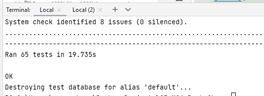
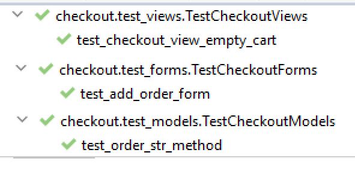
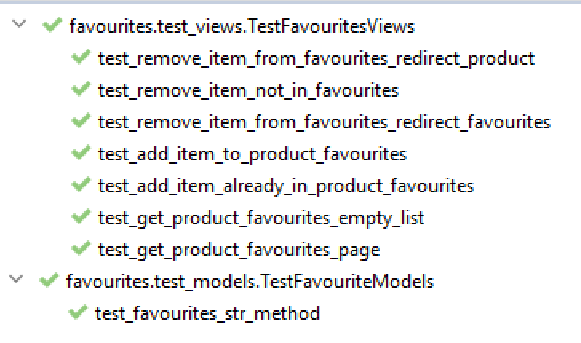
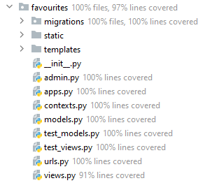
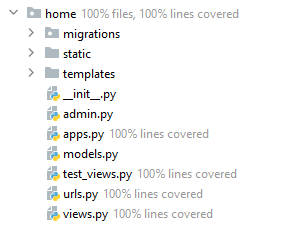
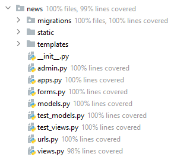
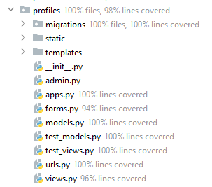

# Table of Contents

# Testing
The testing approach(described in detail in this testing readme) is as follows:
1. Automated unit testing using the Django unit test framework
2. Manual testing using emulators and real devices

## Unit testing information
- I wrote a number of unit tests(65) using the Django unit test framework
- These test cases are structured in a number of suites(13)
- A TDD(Test Driven development) approach was used for writing uni tests, where the test was written as and before the view was written, and the test passed as the view method
was written/developed
- The structure of the unit test is based on the model/form/view structure, for example test_views.py, test_model.py and test_forms.py on a per-app basis
- I used coverage(coverage.py) for code coverage and to ensure a high code coverage was met on all python files in the project
- An overall report is available at the following link [Coverage Report](readme/coverage/index.html)
- To run the unit tests click on Run "Test with Coverage" in your IDE, or at the command line "python manage.py test"
 
- A test database is created and deleted for the test run, and each suite has a set-up:<code>def setUp(self):</code> and teardown:<code>def tearDown(self):</code> methods to create 
the relevant objects needed for the test suite
 

### Unit testing information for the Bag app
- For the bag app one suite was written to test the views
- The bag app does not have any forms or models
- The views' suite contains 8 unit tests testing add/removing items from the bag
 
- In terms of coverage when run as part of the 13 suites, it gives the following code coverage
 

### Unit testing information for the Checkout app
- For the checkout app three suites were written to test the views, form and models
- The suites contain 3 unit tests testing the order creation and forms
 
- In terms of coverage when run as part of the 13 suites, it gives the following code coverage
 

### Unit testing information for the Favourites app
- For the favourites' app two suites were written to test the views and models
- The favourites' app does not have any forms
- The two suites contain 8 unit tests testing adding and removing favourites
 
- In terms of coverage when run as part of the 13 suites, it gives the following code coverage
 

### Unit testing information for the Home app
- For the home app one suite was written to test the views
- The home app does not have any forms or models
- The suite contains 1 unit tests testing the home page template
 
- In terms of coverage when run as part of the 13 suites, it gives the following code coverage
 

### Unit testing information for the News app
- For the news app two suites were written to test the views and models
- The forms are tested as part of these suites
- The two suites contain 17 unit tests testing add/modify/views and delete of news items and comments
 
- In terms of coverage when run as part of the 13 suites, it gives the following code coverage
 

### Unit testing information for the Products app
- For the product's app two suites were written to test the views and models
- The forms are tested as part of these suites
- The two suites contain 24 unit tests testing add/modify/views and delete of reviews and products
 
- In terms of coverage when run as part of the 13 suites, it gives the following code coverage
 

### Unit testing information for the Profile app
- For the product's app two suites were written to test the views and models
- The forms are tested as part of these suites
- The two suites contain 4 unit tests testing the users profile and profile updates
 
- In terms of coverage when run as part of the 13 suites, it gives the following code coverage
 

## Manual testing information
Testing was completed on the following browsers and device types

Device Number | Physical/Emulator | Device Name | Device Type | Browser | Version
------------ | ------------ | ------------- | ------------- | ------------- | -------------
1 | Physical | iPad | Tablet |  Safari | 15.1 |
2 | Physical | iPhone | Mobile |Safari | 15.1 |
3 | Physical | One Plus 5 | Mobile | Chrome | 94.0 |
4 | Physical | Windows Desktop| Desktop | IE Edge | 42.0 |
5 | Physical | Windows Desktop| Desktop | Mozilla Firefox | 85.0 |
6 | Physical | Windows Desktop| Desktop | Chrome | 94.0 |
7 | Emulator | Galaxy S5 | Mobile | Chrome Emulator | 94.0 |
8 | Emulator | iPad | Tablet | Chrome Emulator | 94.0 |
9 | Emulator | iPhone X | Mobile | Chrome Emulator | 94.0 |
10 | Emulator | iPhone 5/SE | Mobile | Chrome Emulator | 94.0 |

- Below are the test results for testing the website requirements against a range of browsers and devices
- For the purpose of the screenshots I used a Chrome emulator for desktop, tablet and mobile (Device numbers 6(Desktop), 8(Tablet), 9(Mobile))

## Feature 1 Navigation Bar
### User Story 1-1

### Test case steps 1-1

### Expected Result 1-1
1. The home/index page will be displayed with logo and navigation bar, with a burger menu on mobile devices

### Actual Result 1-1
Step Number | Desktop | Tablet | Mobile | Result 
------------ | ------------ | ------------- | ------------- | ------------- |
Step 1 | [Desktop Result] | [Tablet Result] |[Mobile Result] | Passed |

## Feature 2 Footer
- User Story 2.1: As an admin/regular user logged in four text messages are displayed with icons regarding delivery, packaging, dispatch and knowledge
- User Story 2.2: As a regular user the footer is displayed with a logo, product links(Rugby Boots, Jerseys, Accessories), website links(Profile/News/Sale)
- User Story 2.3: As an admin user logged in the footer is displayed with a logo, product links(Rugby Boots, Jerseys, Accessories), website links(Product Management/News Item Management)
- User Story 2.4: As a regular user I can sign up for a newsletter by entering my email address and clicking Signup. I will receive an email after signing up

##### User Stories Steps 2
1. As a regular user scroll down to the footer on the homepage 
2. As an admin user scroll down to the footer on the homepage
3. As a regular user sign up to the newsletter

##### User Story Testing Results 2
Step 1 | The footer items are displayed with website links(Profile/News/Sale) | [Desktop](readme/testing/footer_desktop_regular.PNG)  | [Tablet](readme/testing/footer_tablet_regular.PNG)  | [Mobile](readme/testing/footer_mobile_regular.PNG)  | Passed |
Step 2 | The footer items are displayed with website links(Product Management/News Item Management) | [Desktop](readme/testing/footer_desktop_admin.PNG)  | [Tablet](readme/testing/footer_tablet_admin.PNG)  | [Mobile](readme/testing/footer_mobile_admin.PNG)  | Passed |
Step 3 | The user receives an email | [Desktop](readme/testing/mailing_list_email.PNG)  | [Tablet](readme/testing/mailing_list_email.PNG)  | [Mobile](readme/testing/mailing_list_email.PNG)  | Passed |

## Feature 3 Register
- User Story 3.1: As a regular user I can register on the website by providing an email address, email address(confirmation), username, password, password confirmation
- User Story 3.1: As a regular user I will receive an email to verify my account after registering
- User Story 3.1: As a regular user I can log in to my account once I click on the verification link in the email I receive regarding my registration

##### User Stories Steps 3
1. As a regular user, navigate to the registration page, fill in email address, email address(confirmation), username, password, password confirmation and click Sign Up
2. Open the email received
3. Click on the verification link in the email received
4. Confirm the email address for the account
5. Sign in to the account
6. Attempt to register with the same account and do not fill in all the mandatory fields: email address, email address(confirmation), username, password, password confirmation

##### User Story Testing Results 3
Step 1 | The user registers for an account | [Desktop](readme/testing/register_desktop.PNG)  | [Tablet](readme/testing/register_tablet.PNG)  | [Mobile](readme/testing/register_mobile.PNG)  | Passed |
Step 2 | The user receives the email | [Desktop](readme/testing/verify_email_desktop.PNG)  | [Tablet](readme/testing/verify_email_tablet.PNG)  | [Mobile](readme/testing/verify_email_mobile.PNG)  | Passed |
Step 3 | The user clicks on the verification link | [Desktop](readme/testing/verification_email_content.jpg)  | [Tablet](readme/testing/verification_email_content.jpg)  | [Mobile](readme/testing/verification_email_content.jpg)  | Passed |
Step 4 | The user confirms the email address | [Desktop](readme/testing/confirm_email.jpg)  | [Tablet](readme/testing/confirm_email.jpg)  | [Mobile](readme/testing/confirm_email.jpg)  | Passed |
Step 5 | The user logs in to the site | [Desktop](readme/testing/email_confirmed.jpg)  | [Tablet](readme/testing/email_confirmed.jpg)  | [Mobile](readme/testing/email_confirmed.jpg)  | Passed |
Step 6 | A message is displayed to the user | [Desktop](readme/testing/registration_fields.PNG)  | [Tablet](readme/testing/registration_fields.PNG)  | [Mobile](readme/testing/registration_fields.PNG)  | Passed | 

### Feature 4 Login
- User Story 4.1: As an admin/regular user I can log in to the website using my username or email address and password. Both fields are mandatory. Once correct, I will be navigated to the homepage and a message displayed
- User Story 4.2: As an admin/regular user I can request a new password if I forget my current password. I will receive an email to reset my password. Once I reset I can log in
##### User Stories Steps 4
1. Attempt to log in to the website with an account that does not exist or an incorrect password
2. Request a new password
3. Login to the site with the correct account details
##### User Story Testing Results 4
Step 1 | A message is displayed to the user | [Desktop](readme/testing/login_fails_desktop.PNG)  | [Tablet](readme/testing/login_fails_tablet.PNG)  | [Mobile](readme/testing/login_fails_mobile.PNG)  | Passed |
Step 2 | The user receives an email where they can reset their password | [Desktop](readme/testing/password_reset_email.PNG)  | [Tablet](readme/testing/password_reset_email.PNG)  | [Mobile](readme/testing/password_reset_email.PNG)  | Passed |
Step 3 | The user can successfully log in | [Desktop](readme/testing/password_updated_desktop.PNG)  | [Tablet](readme/testing/password_updated_tablet.PNG)  | [Mobile](readme/testing/password_updated_mobile.PNG)  | Passed |

#### Feature 6 Sale items page
- User Story 6.1: As a regular user I can view the products with sale prices, the product image, category, presale price and price is displayed
- User Story 6.2: As a regular user if I click on a product in the sale items, I am navigated to the product detail page for that product
- User Story 6.3: As a regular user if there are more than four products on the sale items page, the page is paginated with four products per page

##### User Stories Steps 6
1. Click on the sale items in the header
2. Click on a product in the sale items 
3. Scroll down to view the pagination

##### User Story Testing Results 6
Step 1 | The sale items and count are displayed | [Desktop](readme/testing/sale_items_desktop.PNG)  | [Tablet](readme/testing/sale_items_desktop.PNG)  | [Mobile](readme/testing/sale_items_desktop.PNG)  | Passed |
Step 2 | The product detail is displayed | [Desktop](readme/testing/product_detail_desktop.PNG)  | [Tablet](readme/testing/product_detail_tablet.PNG)  | [Mobile](readme/testing/product_detail_mobile.PNG)  | Passed |
Step 3 | The pagination is displayed | [Desktop](readme/testing/sale_items_desktop.PNG)  | [Tablet](readme/testing/sale_items_tablet_pagination.PNG)  | [Mobile](readme/testing/sale_items_mobile_pagination.PNG)  | Passed |

### Feature 7 Favourites page
- User Story 7.1: As a regular user I can click on the heart icon on a product in the product details page, a message is displayed, and the product is added to my favourites list
- User Story 7.2: As a regular user I can click on the heart icon on a product that is already in my favourites list, a message is displayed, and the product is removed to my favourites list
- User Story 7.3: As a regular user I can view my favourites list, the product image, category, presale price and price is displayed
- User Story 7.4: As a regular user I remove a product from my favorites list by clicking on the Delete button on the product. A confirmation modal and message is displayed
- User Story 7.5: As a regular user if there are more than four products in my favourites page, the page is paginated with four products per page

##### User Stories Steps 7
1. Click on a product and click the heart icon
2. Go to the favourites page to view the product
3. Click on the heart icon on the product to click on the delete button to remove the item from the favourites

##### User Story Testing Results 7
Step 1 | The product is added to the users favourites list | [Desktop](readme/testing/favourites_add_desktop.PNG)  | [Tablet](readme/testing/favourites_add_tablet.PNG)  | [Mobile](readme/testing/favourites_add_mobile.PNG)  | Passed |
Step 2 | The product is displayed in the favourites list | [Desktop](readme/testing/favourites_desktop.PNG)  | [Tablet](readme/testing/favourites_tablet.PNG)  | [Mobile](readme/testing/favourites_mobile.PNG)  | Passed |
Step 3 | The product is removed from the users favourites list | [Desktop](readme/testing/favourites_delete_desktop.PNG)  | [Tablet](readme/testing/favourites_delete_tablet.PNG)  | [Mobile](readme/testing/favourites_delete_mobile.PNG)  | Passed |

### Feature 8 News Page
- User Story 8.1: As a regular user I can view 4 news items on a page with a news image, and 150 characters of the news item text and a read more button
- User Story 8.2: As a regular user I can click on the read more button on the News page, I will be navigated to the news item with a news item image, news item text and any comments will be displayed
- User Story 8.3: As a regular user I can add a comment to a news item
- User Story 8.4: As a regular user I can delete a comment that I had originally added on a news item
- User Story 8.5: As an admin user I can delete a comment on a news item, even if I did not add the comment

##### User Stories Steps 8
Step 1 | As a regular user click on the News page 
Step 2 | Click on the read more button on a news item   
Step 3 | Add a comment to a news item 
Step 4 | Delete a comment from a news item
Step 5 | As an admin user delete a comment created by a regular user

##### User Story Testing Results 8
Step 1 | The news page is displayed | [Desktop](readme/testing/news_desktop.PNG)  | [Tablet](readme/testing/news_tablet.PNG)  | [Mobile](readme/testing/news_mobile.PNG)  | Passed |
Step 2 | The news item is displayed | [Desktop](readme/testing/news_item_published_desktop.PNG)  | [Tablet](readme/testing/news_item_published_tablet.PNG)  | [Mobile](readme/testing/news_item_published_mobile.PNG)  | Passed |
Step 3 | The comment is added  | [Desktop](readme/testing/news_add_comment_desktop.PNG)  | [Tablet](readme/testing/news_add_comment_tablet.PNG)  | [Mobile](readme/testing/news_add_comment_mobile.PNG)  | Passed |
Step 4 | The comment is deleted | [Desktop](readme/testing/news_delete_comment_desktop.PNG)  | [Tablet](readme/testing/news_delete_comment_tablet.PNG)  | [Mobile](readme/testing/news_delete_comment_mobile.PNG)  | Passed |
Step 5 | The comment is deleted by the admin user | [Desktop](readme/testing/news_delete_comment_admin_desktop.PNG)  | [Tablet](readme/testing/news_delete_comment_admin_tablet.PNG)  | [Mobile](readme/testing/news_delete_comment_admin_mobile.PNG)  | Passed |

### Feature 9 Profile Page
- User Story 9.1: As a regular user I can view my Default delivery information: Phone Number, Street Address 1, Street Address 2, Town or City, County, State or Locality, Postal Code and Country
- User Story 9.2: As a regular user I can update my Default delivery information: Phone Number, Street Address 1, Street Address 2, Town or City, County, State or Locality, Postal Code and Country
- User Story 9.3: As a regular user I can view my order history(Order Number, Date, Items and Order Total)
- User Story 9.4: As a regular user I can click on an order number to view the order information (Order number, Order date/time, Full Name, Street Address 1, Street Address 2, Town or City, County, State or Locality, Postal Code and Country, Phone Number, Order Total, Deliver, Grand Total)

##### User Stories Steps 9
1. Click on the My Profile link under My Account
2. Update one field in the default delivery information (Street Address 2)
3. Click on an order number

##### User Story Testing Results 9
1. The users default delivery information and order history is displayed  | [Desktop](readme/testing/myprofile_desktop.PNG)  | [Tablet](readme/testing/myprofile_tablet.PNG)  | [Mobile](readme/testing/myprofile_mobile.PNG)  | Passed |
2. The users default delivery information is updated and displayed (Street Address 2)  | [Desktop](readme/testing/myprofile_desktop_update.PNG)  | [Tablet](readme/testing/myprofile_tablet_update.PNG)  | [Mobile](readme/testing/myprofile_mobile_update.PNG)  | Passed |
3. The users order details is displayed | [Desktop](readme/testing/order_history_desktop.PNG)  | [Tablet](readme/testing/order_history_tablet.PNG)  | [Mobile](readme/testing/order_history_mobile.PNG)  | Passed |

### Feature 10 Product Management
#### User Story Expected Result 10-1
- User Story 10.1: As an admin user I can add a product by clicking on the Product Management link in My Account. I must enter a name, category, price, colour, code, description and can optionally add a feature (1-4), has Sizes(Unknown, Yes, No), Rating, Pre-sale price, Image url, upload an image and click the 
Add Product button. Clicking cancel navigates the user to the product page.

#### User Story Steps 10-1
- Step 1: As an admin user login navigate to Product Management under MyAccount, and add details to a product and click the Add Product button
- Step 2: Click on the product detail for the product

#### User Story Testing Results 10-1
Step 1 | The add product page is displayed | [Desktop](readme/testing/10_1_1_desktop.PNG)  | [Tablet](readme/testing/10_1_1_tablet.PNG)  | [Mobile](readme/testing/10_1_1_mobile.PNG)  | Passed |
Step 2 | The product detail is displayed | [Desktop](readme/testing/10_1_2_desktop.PNG)  | [Tablet](readme/testing/10_1_2_tablet.PNG)  | [Mobile](readme/testing/10_1_2_mobile.PNG)  | Passed |

#### User Story Expected Result 10-2
- User Story 10.2: As an admin user I can edit a product by clicking on the Edit button on the Products page for the product. I can update thea name, category, price, colour, code, description, feature (1-4), has Sizes(Unknown, Yes, No), Rating, Pre-sale price, Image url, update an image and click the 
Edit Product button. Clicking cancel navigates the user to the product page
#### User Story Steps 10-2
- Step 1: As an admin user login navigate to a product in the products page and click on a product, and click the Edit button
- Step 2: Update the product, for example the price
#### User Story Testing Results 10-2
Step 1 | The edit product page is displayed | [Desktop](readme/testing/10_2_1_desktop.PNG)  | [Tablet](readme/testing/10_2_1_tablet.PNG)  | [Mobile](readme/testing/10_2_1_mobile.PNG)  | Passed |
Step 2 | The product detail is updated with the news price| [Desktop](readme/testing/10_2_2_desktop.PNG)  | [Tablet](readme/testing/10_2_2_tablet.PNG)  | [Mobile](readme/testing/10_2_2_mobile.PNG)  | Passed |

#### User Story Expected Result 10-3
- User Story 10.3: As an admin user I can delete a product by clicking on the Delete button on the product. A modal will appearing asking to confirm, and a message displayed once I confirm.
#### User Story Steps 10-2
- Step 1: As an admin user login navigate to a product in the products page and click on a product, and click the Delete button
- Step 2: Delete the product
#### User Story Testing Results 10-3
Step 1 | The delete-product modal is displayed | [Desktop](readme/testing/10_3_1_desktop.PNG)  | [Tablet](readme/testing/10_3_1_tablet.PNG)  | [Mobile](readme/testing/10_3_1_mobile.PNG)  | Passed |
Step 2 | The product is deleted and the count is reduced| [Desktop](readme/testing/10_3_2_desktop.PNG)  | [Tablet](readme/testing/10_3_2_tablet.PNG)  | [Mobile](readme/testing/10_3_2_mobile.PNG)  | Passed |

### Feature 11 News item Management
- User Story 11.1: As an admin user I can view News items by clicking on the News Item Management link under My account. The news item count and title, create date, status(Published or Draft), and Edit and Delete buttons is displayed
- User Story 11.2: As an admin user if there are more than four news items added, the page is paginated
- User Story 11.3: As an admin user I can add a news item, by clicking on the Add button. I can enter a Title and news item text, add an image and set the item to Published or Draft
- User Story 11.4: As an admin user I can edit a news item, by clicking on the Edit button for the news item. I can update a Title and news item text, update an image and update the item to Published or Draft
- User Story 11.5: As an admin user if a news item is set to Draft, admin and regular users will NOT see this item on the News Page.
- User Story 11.6: As an admin user if a news item is set to Published, admin regular users will see this item on the News Page.
- User Story 11.7: As an admin user I can delete a news item, and I will be asked to confirm the deletion

##### User Stories Steps 11
1. As an admin user click on the News Item Management under My account
2. Click on the Add news item button to add a news item with text and image
3. Click on the Edit news item button to update a news item
4. Click on the News page to see Published items and click on the edited news item, Draft items are not displayed
5. Delete a news item

##### User Story Testing Results 11
Step 1 | The manage news items page is displayed | [Desktop](readme/testing/manage_news_items_desktop.PNG)  | [Tablet](readme/testing/manage_news_items_tablet.PNG)  | [Mobile](readme/testing/manage_news_items_mobile.PNG)  | Passed |
Step 2 | The add news item page is displayed and the news item is added| [Desktop](readme/testing/add_news_item_desktop.PNG)  | [Tablet](readme/testing/add_news_item_tablet.PNG)  | [Mobile](readme/testing/add_news_item_mobile.PNG)  | Passed |
Step 3 | The edit news item page is displayed and the news item is updated| [Desktop](readme/testing/edit_news_item_desktop.PNG)  | [Tablet](readme/testing/edit_news_item_tablet.PNG)  | [Mobile](readme/testing/edit_news_item_mobile.PNG)  | Passed |
Step 4 | The published news item is displayed | [Desktop](readme/testing/news_item_desktop.PNG)  | [Tablet](readme/testing/news_item_tablet.PNG)  | [Mobile](readme/testing/news_item_mobile.PNG)  | Passed |
Step 5 | The news item is deleted | [Desktop](readme/testing/delete_news_item_desktop.PNG)  | [Tablet](readme/testing/delete_news_item_tablet.PNG)  | [Mobile](readme/testing/delete_news_item_mobile.PNG)  | Passed |

### Feature 13 Admin
#### User Story Expected Result 13-1
- User Story 13.1: As an admin user I can view users orders in the django admin page and can view order number, date, full name, order total, delivery cost, grand total
#### User Story Steps 13-1
- Step 1: As an admin user login navigate to https://ci-ms4-loverugby.herokuapp.com/admin/checkout/order/
#### User Story Testing Results 13-1
Step 1 | The orders are displayed | [Result](readme/testing/13_1_order.PNG)  | Passed |

#### User Story Expected Result 13-2
- User Story 13.2: As an admin user I can view users orders in the django admin page and can search by order number, full name and filter by order number, full name and order date
#### User Story Steps 13-2
- Step 1: As an admin user login navigate to https://ci-ms4-loverugby.herokuapp.com/admin/checkout/order/ and filter on a user full name
#### User Story Testing Results 13-1
Step 1 | The order is filtered | [Result](readme/testing/13_2_order.PNG)   | Passed |

#### User Story Expected Result 13-3
- User Story 13.3: As an admin user I can view users favourites in the django admin page and can view all favourites
#### User Story Steps 13-3
- Step 1: As an admin user login navigate to https://ci-ms4-loverugby.herokuapp.com/admin/favourites/favourites/
#### User Story Testing Results 13-3
Step 1 | The favourites are displayed | [Result](readme/testing/13_3_favourites.PNG)   | Passed |

#### User Story Expected Result 13-4
- User Story 13.4: As an admin user I can view users favourites in the django admin page and can search and filter by username
#### User Story Steps 13-4
- Step 1: As an admin user login navigate to https://ci-ms4-loverugby.herokuapp.com/admin/favourites/favourites/ and select a user
### User Story Testing Results 13-4
Step 1 | The favourites are displayed for the user | [Result](readme/testing/13_4_favourites.PNG)   | Passed |

### User Story Expected Result 13-5
- User Story 13.5: As an admin user I can view news items in the django admin page and can view a news item title, user, news item text and image
### User Story Steps 13-5
- Step 1: As an admin user navigate to https://ci-ms4-loverugby.herokuapp.com/admin/news/news/ 
### User Story Testing Results 13-5
Step 1 | The news items are displayed | [Result](readme/testing/13_5_news.PNG)   | Passed |

### User Story Expected Result 13-6
- User Story 13.6: As an admin user I can view news items in the django admin page and can search and search by title, user, news item text and image, create date, update date status and filter by title, user, create date
### User Story Steps 13-6
- Step 1: As an admin user navigate to https://ci-ms4-loverugby.herokuapp.com/admin/news/news/ and filter/search on a news item
### User Story Testing Results 13-6
Step 1 | The news item is filtered  | [Result](readme/testing/13_6_news.PNG)   | Passed |

### User Story Expected Result 13-7
- User Story 13.7: As an admin user I can view products in the django admin page and can view a products code, name, category, has sizes, price, presale price, rating, image, image url
### User Story Steps 13-7
- Step 1: As an admin user navigate to https://ci-ms4-loverugby.herokuapp.com/admin/products/product/
### User Story Testing Results 13-7
Step 1 | The products are displayed | [Result](readme/testing/13_7_products.PNG)   | Passed |

### User Story Expected Result 13-8
- User Story 13.8: As an admin user I can view products in the django admin page and can view search and filter by code, category, name and price
### User Story Steps 13-8
- Step 1: As an admin user navigate to https://ci-ms4-loverugby.herokuapp.com/admin/products/product/ and filter on a category
### User Story Testing Results 13-8
Step 1 | The filtered products are displayed for the category | [Result](readme/testing/13_8_products.PNG)   | Passed |

### User Story Expected Result 13-9
- User Story 13.9: As an admin user I can view users in the django admin page and can view their username, email address, first name, last name, staff status
### User Story Steps 13-9
- Step 1: As an admin user navigate to https://ci-ms4-loverugby.herokuapp.com/admin/auth/user/
### User Story Testing Results 13-9
Step 1 | The users are displayed | [Result](readme/testing/13_9_users.PNG)   | Passed |

### User Story Expected Result 13-10
- User Story 13.10: As an admin user I can view users in the django admin page and can search by username and email address and  filter by staff status, superuser status and active status
### User Story Steps 13-10
- Step 1: As an admin user navigate to https://ci-ms4-loverugby.herokuapp.com/admin/auth/user/ and filter on non superuser status
### User Story Testing Results 13-10
Step 1 | The non superuser users are displayed | [Result](readme/testing/13_10_users.PNG)   | Passed |

### User Story Expected Result 13-11
- User Story 13.11: As an admin user I can view news items comments in the django admin page and can view a comment user, title, text and create date
### User Story Steps 13-11
- Step 1: As an admin user navigate to https://ci-ms4-loverugby.herokuapp.com/admin/news/comment/
### User Story Testing Results 13-11
Step 1 | The comments are displayed | [Result](readme/testing/13_11_comments.PNG)   | Passed |

### User Story Expected Result 13.12
- User Story 13.12: As an admin user I can view news items comments in the django admin page and can filter by user, title, create date and search by user, title, text and create date
### User Story Steps 13.12
- Step 1: As an admin user navigate to https://ci-ms4-loverugby.herokuapp.com/admin/news/comment/ and filter on a comment
### User Story Testing Results 13.12
Step 1 | The comment is displayed | [Result](readme/testing/13_12_comments.PNG)   | Passed |

### User Story Expected Result 13.13
- User Story 13.13: As an admin user I can view reviews in the django admin page and can view a review user, product, rating, text and create date
### User Story Steps 13.13
- Step 1: As an admin user navigate to https://ci-ms4-loverugby.herokuapp.com/admin/products/review/
### User Story Testing Results 13.13
Step 1 | The reviews are displayed | [Result](readme/testing/13_13_reviews.PNG)   | Passed |

### User Story Expected Result 13.14
- User Story 13.14: As an admin user I can view reviews in the django admin page and can filter by user, product rating, create date and search by user, product, rating, text
### User Story Steps 13.14
- Step 1: As an admin user navigate to https://ci-ms4-loverugby.herokuapp.com/admin/products/review/ and filter on a review user
### User Story Testing Results 13.14
Step 1 | The users reviews are displayed | [Result](readme/testing/13_14_reviews.PNG)   | Passed |

### User Story Expected Result 13.15
- User Story 13.15: As an admin user I can view categories in the django admin page and can view a category name and friendly name
### User Story Steps 13.15
- Step 1: As an admin user navigate to https://ci-ms4-loverugby.herokuapp.com/admin/products/category/
### User Story Testing Results 13.15
Step 1 | The categories are displayed | [Result](readme/testing/13_15_categories.PNG)   | Passed |

# Bugs found during the testing phase

Bug no. | Bug description |  Bug fix |
------------ | ------------- | ------------- |
1 | When running html validation, sales_items had same id as news, | The fix was to give both a unique id (main-nav.html)
2 | When running html validation, alt text for a number of images in a loop was the same | The fix was the set it to the product name (products.html) |
3 | If a user has 0 favourites, pagination setup call in the view is being called even though there are no items | The fix was to move the location of the pagination setup call(util.py) |
4 | Ths stripe webhook was not working on production. I had the same secret set on heroku and local development, even though I had two different webhooks defined(development and production) |The fix was to set the correct webhook secret as an environment variable in Heroku
5 | The following error was displayed in logs "norderedObjectListWarning: Pagination may yield inconsistent results with an unordered object_list: <class 'products.models.Product'> QuerySet."| The fix was to update the product and review models to order by id (models.py in Product app)
6 | Combining filtering and pagination does not include the filter text in the pagination page link | Fix was to implement a product_tools template tags from https://www.caktusgroup.com/blog/2018/10/18/filtering-and-pagination-django/
7 | The news item count on the news page was incorrect as it included draft and published in its count | The fix was to update the filter to only include published items <code>News.objects.filter(status=1).count()</code>
8 | On a mobile device the pagination on the products page was overlapping over the div | The fix was to set the flex wrap class <code>flex-wrap: wrap</code>
9/ If items are greater than four, the product, sale, favourites page with pagination doesnt scale right | Update the bootstrap class html to <code>col-sm-6 col-md-6 col-lg-6 col-xl-3</code>

# Code Validators and Website Analysis
The website's pages was tested against the following validators:

## HTML Markup Validation Service
I used https://validator.w3.org/ to validate the html files

Page | Result | Test Detail/Screenshot
------------ | ------------- | -------------
bag/templates/bag/bag.html  | 0 errors and 0 contrast errors| [Results](readme/html_validation/html_validation_bag.PNG) 
bag/templates/bag/bag.html (Empty)  | 0 errors and 0 contrast errors| [Results](readme/html_validation/html_validation_bag_empty.PNG) 
checkout/templates/checkout/checkout.html | 0 errors and 0 contrast errors| [Results](readme/html_validation/html_validation_checkout.PNG)  
checkout/templates/checkout/checkout_success.html | 0 errors and 0 contrast errors| [Results](readme/html_validation/html_validation_checkout_success.png)  
favourites/templates/favourites/favourites.html | 0 errors and 0 contrast errors| [Results](readme/html_validation/html_validation_favourites.PNG)  
home/templates/home/index.html | 0 errors and 0 contrast errors| [Results](readme/html_validation/html_validation_index.PNG)
news/templates/news/add_news_item.html | 0 errors and 0 contrast errors| [Results](readme/html_validation/html_validation_add_news_item.PNG)   
news/templates/news/edit_news_item.html | 0 errors and 0 contrast errors| [Results](readme/html_validation/html_validation_edit_news_item.png)  
news/templates/news/manage_news_items.html | 0 errors and 0 contrast errors| [Results](readme/html_validation/html_validation_news_item_management.PNG) 
news/templates/news/news.html | 0 errors and 0 contrast errors| [Results](readme/html_validation/html_validation_news.PNG)  
news/templates/news/news_item.html | 0 errors and 0 contrast errors| [Results](readme/html_validation/html_validation_news_item.png)
products/templates/products/add_product.html | 0 errors and 0 contrast errors| [Results](readme/html_validation/html_validation_add_product.PNG)
products/templates/products/edit_product.html | 0 errors and 0 contrast errors| [Results](readme/html_validation/html_validation_edit_product.PNG)  
products/templates/products/product_detail.html | 0 errors and 0 contrast errors| [Results](readme/html_validation/html_validation_product_detail.PNG) 
products/templates/products/products.html | 0 errors and 0 contrast errors| [Results](readme/html_validation/html_validation_products.PNG)   
products/templates/products/sale_items.html | 0 errors and 0 contrast errors| [Results](readme/html_validation/html_validation_sale_items.png)     
profile/templates/profile/profile.html | 0 errors and 0 contrast errors| [Results](readme/html_validation/html_validation_profile.PNG)  
profile/templates/profile/order_history.html | 0 errors and 0 contrast errors| [Results](readme/html_validation/html_validation_order_history.PNG)  
templates/allauth/account/login.html | 0 errors and 0 contrast errors| [Results](readme/html_validation/html_validation_login.PNG)
templates/allauth/account/logout.html | 0 errors and 0 contrast errors| [Results](readme/html_validation/html_validation_logout.PNG)
templates/allauth/account/register.html | 0 errors and 0 contrast errors| [Results](readme/html_validation/html_validation_register.PNG) 
templates/allauth/account/password_change.html | 0 errors and 0 contrast errors| [Results](readme/html_validation/html_validation_change_password.png)
templates/allauth/account/password_reset.html | 0 errors and 0 contrast errors| [Results](readme/html_validation/html_validation_forgot_password.PNG)
templates/allauth/account/password_reset_done.html | 0 errors and 0 contrast errors| [Results](readme/html_validation/html_validation_change_password_confirmed.png)
templates/allauth/account/verification_sent.html | 0 errors and 0 contrast errors| [Results](readme/html_validation/html_validation_verification_email_sent.png)
 

## CSS Validation Service
I used https://jigsaw.w3.org/css-validator/ to validate the css(style.css)

    

Page | Result | Test Detail/Screenshot
------------ | ------------- | -------------
static/css/base.css | Passed, No errors found | [Results](readme/css_validation/base_css_validation.png) 
checkout/static/checkout/css/checkout.css | Passed, No errors found | [Results](readme/css_validation/checkout_css_validation.png)  

 

## Chrome Dev tools Lighthouse 

- I used Lighthouse (https://developers.google.com/web/tools/lighthouse) to test the performance, seo, best practices and accessibility of the site
- Overall the results are very good for the 4 values: Performance, Accessibility, Best Practices and SEO

### Desktop
Page  | Performance (%) | Accessibility (%) | Best Practices (%) | SEO (%)
------------  | ------------ | ------------- | ------------- | -------------
bag/templates/bag/bag.html | 96 | 96 | 80 | 100 |
checkout/templates/checkout/checkout.html | 82 | 100 | 80 | 100 |
checkout/templates/checkout/checkout_success.html | 95 | 100 | 87 | 100 ||
favourites/templates/favourites/favourites.html | 97 | 100 | 87 | 90 |
home/templates/home/index.html | 91 | 100 | 87 | 100 ||
news/templates/news/add_news_item.html | 97 | 92 | 87 | 100 |
news/templates/news/edit_news_item.html | 98 | 92 | 87 | 100 |
news/templates/news/manage_news_items.html  | 98 | 100 | 87 | 90 |
news/templates/news/news.html | 95 | 100 | 87 | 90 |
news/templates/news/news_item.html | 96 | 100 | 87 | 100 |
products/templates/products/add_product.html | 94 | 92 | 87 | 100 |
products/templates/products/edit_product.html | 97 | 92 | 87 | 100 |
products/templates/products/product_detail.html | 96 | 100 | 80 | 100 |
products/templates/products/products.html  | 96 | 100 | 87 | 100 |
products/templates/products/sale_items.html | 96 | 100 | 87 | 100 |
profile/templates/profile/profile.html | 97 | 100 | 87 | 100 |
profile/templates/profile/order_history.html | 95 | 100 | 87 | 100 |
templates/allauth/account/login.html | 94 | 100 |87 | 100 |
templates/allauth/account/logout.html | 93 | 100 | 87 | 100 |
templates/allauth/account/register.html | 98| 100 | 87 | 100 |

### Mobile
Page  | Performance (%) | Accessibility (%) | Best Practices (%) | SEO (%)
------------  | ------------ | ------------- | ------------- | -------------
bag/templates/bag/bag.html | 60 | 93 | 87 | 100 |
checkout/templates/checkout/checkout.html | 65 | 98 | 87 | 100 |
checkout/templates/checkout/checkout_success.html | 67 | 97 | 87 | 100 |
favourites/templates/favourites/favourites.html | 70 | 97 | 87 | 100 |
home/templates/home/index.html | 62 | 97 | 87 | 100 |
news/templates/news/add_news_item.html | 81 | 89 | 87 | 100 |
news/templates/news/edit_news_item.html | 74 | 89 | 87 | 100 |
news/templates/news/manage_news_items.html  | 73 | 98 | 87 | 92 |
news/templates/news/news.html | 72 | 97 | 80 | 92 |
news/templates/news/news_item.html | 71 | 98 | 87 | 100 |
products/templates/products/add_product.html | 77 | 89 | 87 | 100 |
products/templates/products/edit_product.html | 79 | 89 | 87 | 100 |
products/templates/products/product_detail.html | 70 | 98 | 80 | 100 |
products/templates/products/products.html  | 76 | 97 | 87 | 92 |
products/templates/products/sale_items.html | 72 | 97 | 87 | 92 |
profile/templates/profile/profile.html | 76 | 98 | 87 | 100 |
profile/templates/profile/order_history.html | 70 | 97 | 87 | 100 |
templates/allauth/account/login.html | 78 | 97 | 87 | 98 |
templates/allauth/account/logout.html | 74 | 97 | 87 | 100 |
templates/allauth/account/register.html | 73 | 97 | 87 | 100 |

 

## Wave Accessibility
- Wave accessibility(https://wave.webaim.org/) was used to test the websites accessibility

Page | Result | Test Detail/Screenshot
------------ | ------------- | -------------
bag/templates/bag/bag.html  | 0 errors and 0 contrast errors| [Results](readme/wave_validation/wave_bag.PNG) 
bag/templates/bag/bag.html (Empty)  | 0 errors and 0 contrast errors| [Results](readme/wave_validation/wave_bag_empty.PNG) 
checkout/templates/checkout/checkout.html | 0 errors and 0 contrast errors| [Results](readme/wave_validation/wave_checkout_success.png) 
checkout/templates/checkout/checkout_success.html | 0 errors and 0 contrast errors| [Results](readme/wave_validation/wave_checkout.png) 
favourites/templates/favourites/favourites.html | 0 errors and 0 contrast errors| [Results](readme/wave_validation/wave_favourites.PNG)  
home/templates/home/index.html | 0 errors and 0 contrast errors| [Results](readme/wave_validation/wave_index.PNG)
news/templates/news/add_news_item.html | 0 errors and 0 contrast errors| [Results](readme/wave_validation/wave_add_news.PNG)   
news/templates/news/edit_news_item.html | 0 errors and 0 contrast errors| [Results](readme/wave_validation/wave_edit_news.PNG)  
news/templates/news/manage_news_items.html | 0 errors and 0 contrast errors| [Results](readme/wave_validation/wave_news_item_management.PNG) 
news/templates/news/news.html | 0 errors and 0 contrast errors| [Results](readme/wave_validation/wave_news.PNG)  
news/templates/news/news_item.html | 0 errors and 0 contrast errors| [Results](readme/wave_validation/wave_news_item.PNG)  
products/templates/products/add_product.html | 0 errors and 0 contrast errors| [Results](readme/wave_validation/wave_add_product.PNG)
products/templates/products/edit_product.html | 0 errors and 0 contrast errors| [Results](readme/wave_validation/wave_edit_product.PNG)  
products/templates/products/product_detail.html | 0 errors and 0 contrast errors| [Results](readme/wave_validation/wave_product_detail.PNG)  
products/templates/products/products.html | 0 errors and 0 contrast errors| [Results](readme/wave_validation/wave_products.PNG)   
products/templates/products/sale_items.html | 0 errors and 0 contrast errors| [Results](readme/wave_validation/wave_sale_items.PNG) 
profile/templates/profile/profile.html | 0 errors and 0 contrast errors| [Results](readme/wave_validation/wave_profile.PNG)  
profile/templates/profile/order_history.html | 0 errors and 0 contrast errors| [Results](readme/wave_validation/wave_order_history.PNG)  
templates/allauth/account/login.html | 0 errors and 0 contrast errors| [Results](readme/wave_validation/wave_login.PNG)
templates/allauth/account/logout.html | 0 errors and 0 contrast errors| [Results](readme/wave_validation/wave_logout.PNG)
templates/allauth/account/register.html | 0 errors and 0 contrast errors| [Results](readme/wave_validation/wave_register.PNG) 
templates/allauth/account/password_change.html | 0 errors and 0 contrast errors| [Results](readme/wave_validation/wave_change_password.png) 
templates/allauth/account/password_reset.html | 0 errors and 0 contrast errors| [Results](readme/wave_validation/wave_password_forgot.PNG)
templates/allauth/account/password_change_done.html | 0 errors and 0 contrast errors| [Results](readme/wave_validation/wave_change_password_confirmed.png) 
templates/allauth/account/verification_sent.html | 0 errors and 0 contrast errors| [Results](readme/wave_validation/wave_verification_email_confirmation.png))
templates/allauth/account/verification_email_required.html | 0 errors and 0 contrast errors| [Results](readme/wave_validation/wave_verification_email_sent.png)

## JSHint
- JSHint(https://jshint.com/) was used to analyse the Javascript files

Page | Result | Test Detail/Screenshot
------------ | ------------- | -------------
bag/templates/bag/bag.html | 0 errors and 0 warnings | [Results](readme/jshint/jshint_bag.PNG)
checkout/static/checkout/carousel.js | 0 errors and 0 warnings | [Results](readme/jshint/jshint_stripe_elements.PNG) 
home/static/home/carousel.js | 0 errors and 0 warnings | [Results](readme/jshint/jshint_carousel.PNG) 
news/static/news/carousel.js | 0 errors and 0 warnings | [Results](readme/jshint/jshint_news.PNG) 
favourites/static/favourites/favourites.js | 0 errors and 0 warnings | [Results](readme/jshint/jshint_favourites.PNG) 
products/static/products/products.js | 0 errors and 0 warnings | [Results](readme/jshint/jshint_products.PNG)
static/js/toast.js | 0 errors and 0 warnings | [Results](readme/jshint/jshint_toast.PNG)
static/js/send_email.js | 0 errors and 0 warnings | [Results](readme/jshint/jshint_send_email.png)

 

## PEP8online
- PEP8online was used to analyse the Python files (https://pep8online.com/)
- I used the pep8 checker in my IDE Pycharm, and created a scope and included the following files
 
- The report shows no errors/warnings for the files listed below
 
- One of the main errors on several files was to ensure the character count was less than 80 characters

Page | Result 
------------ | ------------- 
bag/admin.py | No errors/warnings 
bag/apps.py | No errors/warnings 
bag/contexts.py | No errors/warnings 
bag/models.py | No errors/warnings 
bag/test_views.py | No errors/warnings 
bag/urls.py | No errors/warnings 
bag/views.py | No errors/warnings 
checkout/admin.py | No errors/warnings 
checkout/apps.py | No errors/warnings 
checkout/forms.py | No errors/warnings 
checkout/models.py | No errors/warnings 
checkout/signals.py | No errors/warnings 
checkout/test_forms.py | No errors/warnings 
checkout/test_models.py | No errors/warnings 
checkout/test_views.py | No errors/warnings 
checkout/urls.py | No errors/warnings 
checkout/views.py | No errors/warnings 
checkout/webhook_handler.py | No errors/warnings 
checkout/webhooks.py | No errors/warnings 
favourites/admin.py | No errors/warnings 
favourites/apps.py | No errors/warnings 
favourites/contexts.py | No errors/warnings 
favourites/models.py | No errors/warnings 
favourites/test_models.py | No errors/warnings 
favourites/test_views.py | No errors/warnings 
favourites/urls.py | No errors/warnings 
favourites/views.py | No errors/warnings 
home/admin.py | No errors/warnings 
home/apps.py | No errors/warnings 
home/models.py | No errors/warnings 
home/test_views.py | No errors/warnings 
home/urls.py | No errors/warnings 
home/views.py | No errors/warnings 
news/admin.py | No errors/warnings 
news/apps.py | No errors/warnings 
news/forms.py | No errors/warnings 
news/models.py | No errors/warnings 
news/test_models.py | No errors/warnings 
news/test_views.py | No errors/warnings 
news/urls.py | No errors/warnings 
news/views.py | No errors/warnings 
products/admin.py | No errors/warnings 
products/apps.py | No errors/warnings 
products/forms.py | No errors/warnings 
products/models.py | No errors/warnings 
products/test_forms.py | No errors/warnings 
products/test_models.py | No errors/warnings 
products/test_views.py | No errors/warnings 
products/urls.py | No errors/warnings 
products/views.py | No errors/warnings 
products/widgets.py | No errors/warnings 
profiles/admin.py | No errors/warnings 
profiles/apps.py | No errors/warnings 
profiles/forms.py | No errors/warnings 
profiles/models.py | No errors/warnings 
profiles/test_models.py | No errors/warnings 
profiles/test_views.py | No errors/warnings 
profiles/urls.py | No errors/warnings 
profiles/views.py | No errors/warnings 
custom_storages.py | No errors/warnings
env.py | No errors/warnings
manage.py | No errors/warnings
unit/unit.py | No errors/warnings
